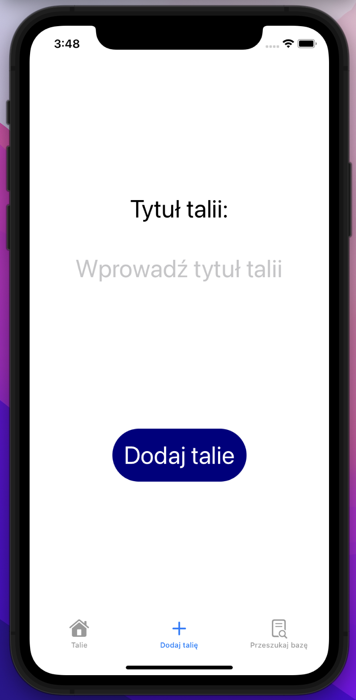
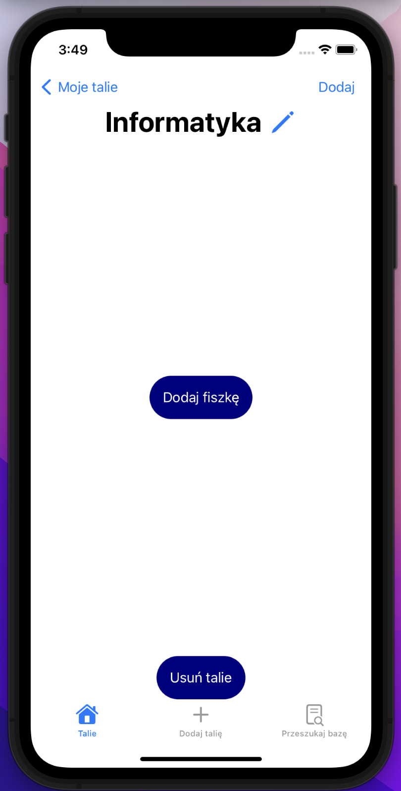
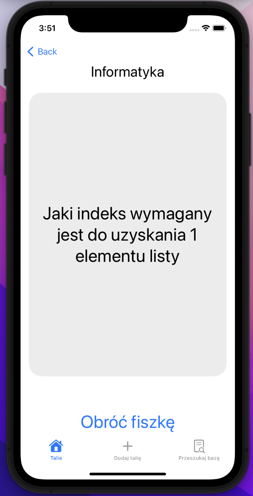
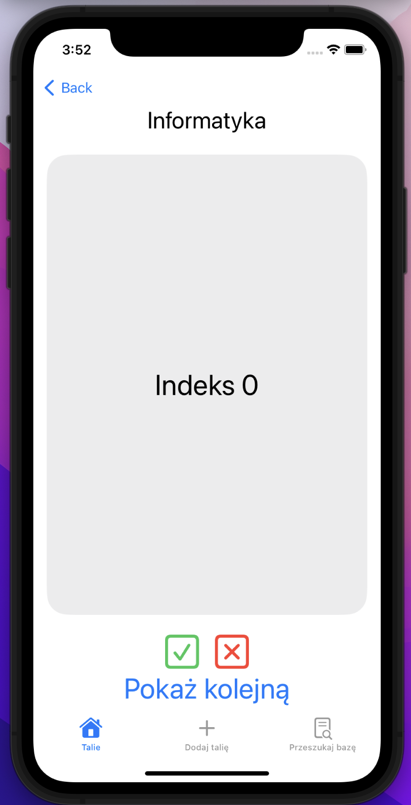
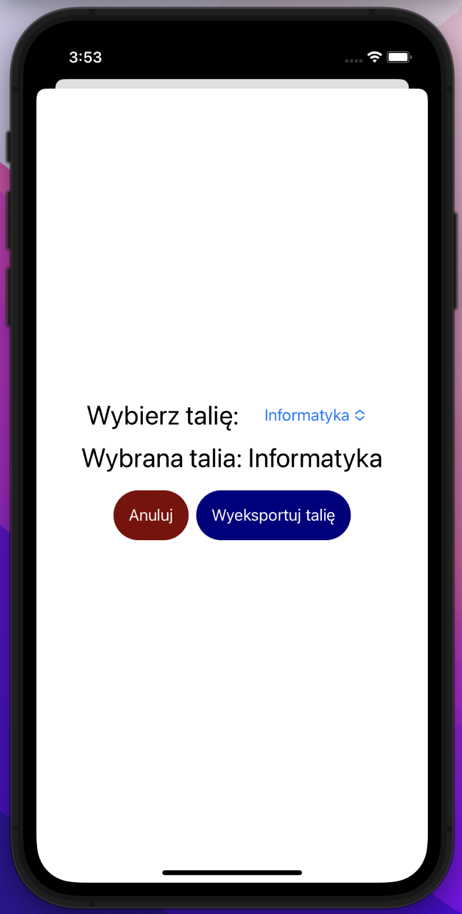
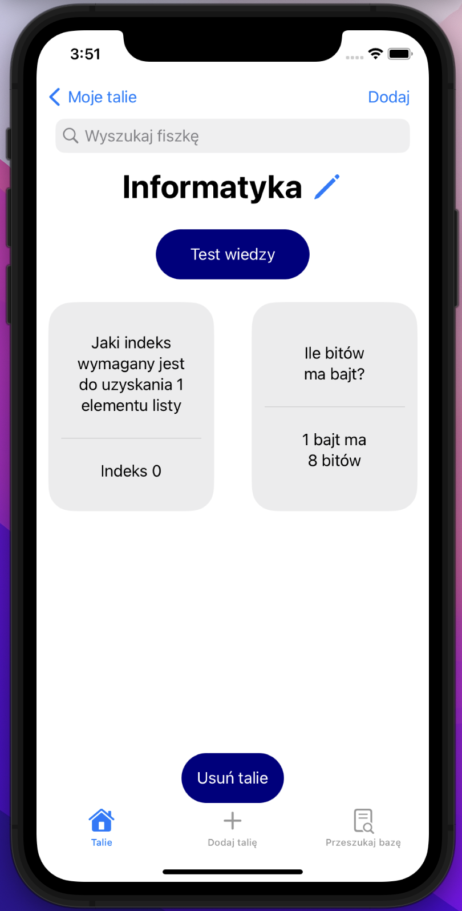

# Flashcards
The Flascards app has been made to ease process of learning for users. They have all needed resources for exam in pocket of their pants. User can create
flashcard decks, do simple test of their knowledge and even share their work or download repositories made by other users.
 
 
 

### Used Technologies:
1. SwiftUI
2. Saving to JSON on user device
3. Firebase
4. SFSymbols
 

### Screenshots
#### Create new deck view

#### Create new flashcard view

#### Question view during test

#### Answer view during test

#### Browse decks view

#### Export deck sheet view

#### Deck with flascards view

